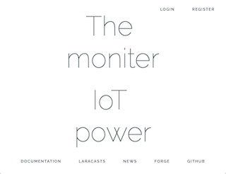
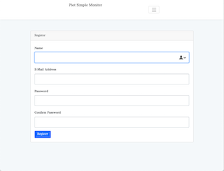
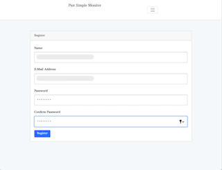
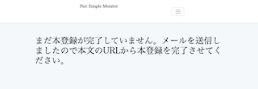
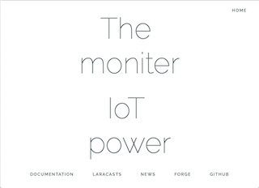

# ghf_webapp 開発環境の作り方

本章では、ghf_webapp アプリケーションをお使いのローカル環境や契約サーバー上に展開・動作させるまでの説明を行います。

ghf_webapp アプリケーションは Laravel を使って作成されています。
よって本章の読者には基本的に Laravel を使ったアプリケーションの作成は知っている方を想定し、
本章では Laravel のインストールや composer, artizan などの説明は行なっていません。


## clone
農園センサー用ウェブアプリ ghf_webapp を github からローカルな開発フォルダや開発サーバに clone します。

	$ git clone https://github.com/piot-jp-Team/ghf_webapp

## composer install
### 1回目 --> エラー
composer install を実行し、必要なパッケージをインストールします。  
しかし、ghf_webapp は composer install 中に以下のエラーが出ます。これは既知の不具合です。

```
> @php artisan package:discover

   Symfony\Component\Debug\Exception\FatalErrorException  : Trait 'Illuminate\Console\AppNamespaceDetectorTrait' not found

  at /Applications/MAMP/htdocs/ghf_webapp/vendor/laralib/l5scaffold/src/Commands/ScaffoldMakeCommand.php:21
```

この不具合の理由は ghf_webapp で使用しているパッケージの中で Laravel 5.5 環境に依存している部分があるためです。

### 修正方法
composer install を実行したことにより、vendor フォルダに複数のパッケージがインストールされています。  
その中で、上記のエラーメッセージにある、
	vendor/laralib/l5scaffold/src/Commands/ScaffoldMakeCommand.php
を以下のように修正します。  
(修正前) AppNamespaceDetectorTrait  
(修正後) DetectsApplicationNamespace  

具体的には、  
修正前
```
5: use Illuminate\Console\AppNamespaceDetectorTrait;

19: class ScaffoldMakeCommand extends Command
20: {
21:     use AppNamespaceDetectorTrait, MakerTrait;

```

修正後
```
5: use Illuminate\Console\DetectsApplicationNamespace;

19: class ScaffoldMakeCommand extends Command
20: {
21:     use DetectsApplicationNamespace, MakerTrait;

```

### 再度 composer install 
上記ファイルを修正したあとで、再度 composer install を実行し、成功すれば OK です。

```
$ composer install
Loading composer repositories with package information
Installing dependencies (including require-dev) from lock file
Nothing to install or update
Generating optimized autoload files
> Illuminate\Foundation\ComposerScripts::postAutoloadDump
> @php artisan package:discover
Discovered Package: encore/laravel-admin
Discovered Package: fideloper/proxy
Discovered Package: jrean/laravel-user-verification
Discovered Package: laravel/tinker
Discovered Package: laravelcollective/html
Discovered Package: nunomaduro/collision
Package manifest generated successfully.
```

## データベースの準備、メーラの準備、.env の修正

ghf_webapp はセンサーデータ、ユーザ管理にデータベースを利用しています。  
よって使用する環境で、データベースを準備してください。

またユーザ認証に関してメールによる認証を利用しています。こちらも使用する環境で smtp サーバーを準備するか gmail など外部のメールサーバーの準備をしてください。

データベースとメールサーバーの準備ができたら、.env ファイルを準備します。  
ghf_webapp アプリケーションのトップフォルダの .env.example をコピーするか、自前で用意してください。  
.env.example をコピーした場合、

主に確認するべき項目は以下です。
- APP_NAME
- DB_CONNECTION
- DB_ 関連
- MAIL_ 関連

## artisan でいくつか

データベースの設定、メールサーバーの設定、.env の修正までが終了したら、いくつか artisan を使った設定をしておく必要があります。

### 暗号化キーの設定

```
$ php artisan key:generate
Application key [base64:********************************************] set successfully.
```

### マイグレーションの実行

ghf_webapp では Laravel アプリの通常のマイグレーション、プラスもう一つ vendor 系のマイグレーションを実行する必要があるので注意してください。

```
$ php artisan migrate
    :
$ php artisan migrate --path="/vendor/jrean/laravel-user-verification/src/resources/migrations"
Migrating: 2016_09_13_070520_add_verification_to_user_table
Migrated:  2016_09_13_070520_add_verification_to_user_table
```

### シーダーの実行
```
$ php artisan db:seed
Seeding: SensorsTableSeeder
Seeding: AlertquesTableSeeder
Seeding: ProjectatusersTableSeeder
```

## 最初のアクセスとユーザ登録まで
### 作成した ghf_webapp にアクセスします。



### ユーザ登録をするために REGISTER をクリックします。



### ユーザ登録を行います。



### 以下の画面が出て、設定したユーザのメールアドレスに登録メールが送られます。



### メール本文の URL をクリックすると以下の画面が出ます。




